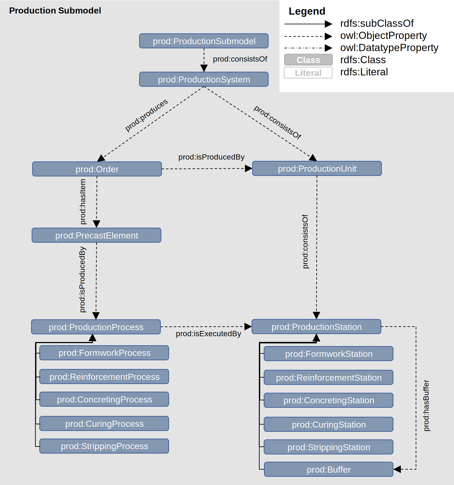

Markdown documentation created by [pyLODE](http://github.com/rdflib/pyLODE) 2.4

# AAS Production Submodel (PROD)

## Metadata
* **IRI**
  * `https://rub-informatik-im-bauwesen.github.io/prod`
* **Creators(s)**
  * [Philipp Hagedorn](https://orcid.org/0000-0002-6249-243X)
    [[ORCID]](https://orcid.org/0000-0002-6249-243X)
    (<philipp.hagedorn-n6v@rub.de></a>) of [Ruhr University Bochum](https://www.inf.bi.ruhr-uni-bochum.de/iib/lehrstuhl/mitarbeiter/philipp_hagedorn.html.en)
  * [Simon Kosse](https://orcid.org/0000-0002-6391-784X)
    [[ORCID]](https://orcid.org/0000-0002-6391-784X)
    (<simon.kosse@rub.de></a>) of [Ruhr University Bochum](https://www.inf.bi.ruhr-uni-bochum.de/iib/lehrstuhl/mitarbeiter/simon_kosse.html.en)
* **Created**
  * 2024-02-01
* **Version Information**
  * 1.0
* **Imports**
  * [aas:](https://admin-shell.io/aas/3/0/)
* **License &amp; Rights**
  * [https://creativecommons.org/licenses/by/4.0/](https://creativecommons.org/licenses/by/4.0/)
  * &copy; 2024 by Chair of Computing in Engineering, Ruhr University Bochum
* **Source**
  * [https://github.com/RUB-Informatik-im-Bauwesen/prod](https://github.com/RUB-Informatik-im-Bauwesen/prod)
* **Ontology RDF**
  * RDF ([.\ProductionSubmodel.ttl](turtle))
### Description

The Production Submodel (PROD) for the Asset Administration Shell (AAS) is defined for providing information about the submodel for industrialized precast concrete production. The submodel is aligned with the relevant terminology of the AAS data model according to the specification version v3.0 at https://admin-shell.io/aas/3/0/

## Table of Contents
1. [Classes](#classes)
1. [Object Properties](#objectproperties)
1. [Datatype Properties](#datatypeproperties)
1. [Namespaces](#namespaces)
1. [Legend](#legend)

## Overview

**Figure 1:** Ontology overview
## Classes
[Buffer](#Buffer),
[ConcretingProcess](#ConcretingProcess),
[ConcretingStation](#ConcretingStation),
[CuringProcess](#CuringProcess),
[CuringStation](#CuringStation),
[FormworkProcess](#FormworkProcess),
[FormworkStation](#FormworkStation),
[Order](#Order),
[PrecastElement](#PrecastElement),
[ProductionProcess](#ProductionProcess),
[ProductionStation](#ProductionStation),
[ProductionSubmodel](#ProductionSubmodel),
[ProductionSystem](#ProductionSystem),
[ProductionUnit](#ProductionUnit),
[ReinforcementProcess](#ReinforcementProcess),
[ReinforcementStation](#ReinforcementStation),
[StrippingProcess](#StrippingProcess),
[StrippingStation](#StrippingStation),
### Buffer
Property | Value
--- | ---
IRI | `https://rub-informatik-im-bauwesen.github.io/prod#Buffer`
Super-classes |[prod:ProductionStation](ProductionStation) (c) 
Restrictions |[prod:bufferSize](bufferSize) (dp) **min** 1 
In range of |[prod:hasBuffer](hasBuffer) (op) 
### ConcretingProcess
Property | Value
--- | ---
IRI | `https://rub-informatik-im-bauwesen.github.io/prod#ConcretingProcess`
Super-classes |[prod:ProductionProcess](ProductionProcess) (c) 
### ConcretingStation
Property | Value
--- | ---
IRI | `https://rub-informatik-im-bauwesen.github.io/prod#ConcretingStation`
Super-classes |[prod:ProductionStation](ProductionStation) (c) 
### CuringProcess
Property | Value
--- | ---
IRI | `https://rub-informatik-im-bauwesen.github.io/prod#CuringProcess`
Super-classes |[prod:ProductionProcess](ProductionProcess) (c) 
### CuringStation
Property | Value
--- | ---
IRI | `https://rub-informatik-im-bauwesen.github.io/prod#CuringStation`
Super-classes |[prod:ProductionStation](ProductionStation) (c) 
### FormworkProcess
Property | Value
--- | ---
IRI | `https://rub-informatik-im-bauwesen.github.io/prod#FormworkProcess`
Super-classes |[prod:ProductionProcess](ProductionProcess) (c) 
### FormworkStation
Property | Value
--- | ---
IRI | `https://rub-informatik-im-bauwesen.github.io/prod#FormworkStation`
Super-classes |[prod:ProductionStation](ProductionStation) (c) 
### Order
Property | Value
--- | ---
IRI | `https://rub-informatik-im-bauwesen.github.io/prod#Order`
Super-classes |[aas:SubmodelElementCollection](https://admin-shell.io/aas/3/0/SubmodelElementCollection) (c) 
Restrictions |[prod:isProducedBy](isProducedBy) (op) **some** [prod:ProductionUnit](ProductionUnit) (c) [prod:dueDate](dueDate) (dp) **exactly** 1 [prod:expectedDeliveryDate](expectedDeliveryDate) (dp) **exactly** 1 [prod:orderID](orderID) (dp) **exactly** 1 [prod:hasItem](hasItem) (op) **some** [prod:PrecastElement](PrecastElement) (c) [prod:isPartOf](isPartOf) (op) **some** [prod:ProductionSystem](ProductionSystem) (c) 
In domain of |[prod:hasItem](hasItem) (op) [prod:dueDate](dueDate) (dp) [prod:isProducedBy](isProducedBy) (op) [prod:expectedDeliveryDate](expectedDeliveryDate) (dp) [prod:orderID](orderID) (dp) 
In range of |[prod:produces](produces) (op) [prod:isItemOf](isItemOf) (op) 
### PrecastElement
Property | Value
--- | ---
IRI | `https://rub-informatik-im-bauwesen.github.io/prod#PrecastElement`
Super-classes |[aas:SubmodelElementCollection](https://admin-shell.io/aas/3/0/SubmodelElementCollection) (c) 
Restrictions |[prod:quantity](quantity) (dp) **exactly** 1 [prod:componentType](componentType) (dp) **exactly** 1 [prod:precastElementAAS](precastElementAAS) (op) **exactly** 1 [aas:AssetAdministrationShell](https://admin-shell.io/aas/3/0/AssetAdministrationShell) (c) [prod:isProducedBy](isProducedBy) (op) **some** [prod:ProductionProcess](ProductionProcess) (c) [prod:isItemOf](isItemOf) (op) **some** [prod:Order](Order) (c) [prod:isProducedBy](isProducedBy) (op) **exactly** 1 [prod:ProductionUnit](ProductionUnit) (c) 
In domain of |[prod:quantity](quantity) (dp) [prod:isItemOf](isItemOf) (op) [prod:isProducedBy](isProducedBy) (op) [prod:componentType](componentType) (dp) [prod:precastElementAAS](precastElementAAS) (op) 
In range of |[prod:hasItem](hasItem) (op) [prod:produces](produces) (op) 
### ProductionProcess
Property | Value
--- | ---
IRI | `https://rub-informatik-im-bauwesen.github.io/prod#ProductionProcess`
Super-classes |[aas:SubmodelElementCollection](https://admin-shell.io/aas/3/0/SubmodelElementCollection) (c) 
Restrictions |[prod:expectedDuration](expectedDuration) (dp) **exactly** 1 [prod:expectedStartTime](expectedStartTime) (dp) **exactly** 1 [prod:isExecutedBy](isExecutedBy) (op) **exactly** 1 [prod:ProductionStation](ProductionStation) (c) [prod:startTime](startTime) (dp) **exactly** 1 [prod:canBeExecutedBy](canBeExecutedBy) (op) **min** 1 [prod:ProductionStation](ProductionStation) (c) [prod:produces](produces) (op) **some** [prod:PrecastElement](PrecastElement) (c) [prod:endTime](endTime) (dp) **exactly** 1 [prod:sequencePosition](sequencePosition) (dp) **exactly** 1 
Sub-classes |[prod:ConcretingProcess](ConcretingProcess) (c) [prod:CuringProcess](CuringProcess) (c) [prod:FormworkProcess](FormworkProcess) (c) [prod:StrippingProcess](StrippingProcess) (c) [prod:ReinforcementProcess](ReinforcementProcess) (c) 
In domain of |[prod:endTime](endTime) (dp) [prod:expectedStartTime](expectedStartTime) (dp) [prod:bufferSize](bufferSize) (dp) [prod:isExecutedBy](isExecutedBy) (op) [prod:expectedDuration](expectedDuration) (dp) [prod:canBeExecutedBy](canBeExecutedBy) (op) [prod:sequencePosition](sequencePosition) (dp) [prod:produces](produces) (op) [prod:startTime](startTime) (dp) 
In range of |[prod:isProducedBy](isProducedBy) (op) 
### ProductionStation
Property | Value
--- | ---
IRI | `https://rub-informatik-im-bauwesen.github.io/prod#ProductionStation`
Super-classes |[aas:SubmodelElementCollection](https://admin-shell.io/aas/3/0/SubmodelElementCollection) (c) 
Restrictions |[prod:hasBuffer](hasBuffer) (op) **some** [prod:Buffer](Buffer) (c) [prod:prodStationAAS](prodStationAAS) (op) **exactly** 1 [aas:AssetAdministrationShell](https://admin-shell.io/aas/3/0/AssetAdministrationShell) (c) [prod:isPartOf](isPartOf) (op) **some** [prod:ProductionUnit](ProductionUnit) (c) 
Sub-classes |[prod:CuringStation](CuringStation) (c) [prod:Buffer](Buffer) (c) [prod:ConcretingStation](ConcretingStation) (c) [prod:FormworkStation](FormworkStation) (c) [prod:ReinforcementStation](ReinforcementStation) (c) [prod:StrippingStation](StrippingStation) (c) 
In domain of |[prod:hasBuffer](hasBuffer) (op) [prod:prodStationAAS](prodStationAAS) (op) 
In range of |[prod:isExecutedBy](isExecutedBy) (op) [prod:canBeExecutedBy](canBeExecutedBy) (op) 
### ProductionSubmodel
Property | Value
--- | ---
IRI | `https://rub-informatik-im-bauwesen.github.io/prod#ProductionSubmodel`
Super-classes |[aas:Submodel](https://admin-shell.io/aas/3/0/Submodel) (c) 
Restrictions |[prod:consistsOf](consistsOf) (op) **some** [prod:ProductionSystem](ProductionSystem) (c) 
### ProductionSystem
Property | Value
--- | ---
IRI | `https://rub-informatik-im-bauwesen.github.io/prod#ProductionSystem`
Super-classes |[aas:SubmodelElementCollection](https://admin-shell.io/aas/3/0/SubmodelElementCollection) (c) 
Restrictions |[prod:consistsOf](consistsOf) (op) **some** [prod:ProductionUnit](ProductionUnit) (c) [prod:produces](produces) (op) **some** [prod:Order](Order) (c) 
In domain of |[prod:produces](produces) (op) 
In range of |[prod:isProducedBy](isProducedBy) (op) 
### ProductionUnit
Property | Value
--- | ---
IRI | `https://rub-informatik-im-bauwesen.github.io/prod#ProductionUnit`
Super-classes |[aas:SubmodelElementCollection](https://admin-shell.io/aas/3/0/SubmodelElementCollection) (c) 
Restrictions |[prod:isPartOf](isPartOf) (op) **some** [prod:ProductionSystem](ProductionSystem) (c) [prod:consistsOf](consistsOf) (op) **some** [prod:ProductionStation](ProductionStation) (c) 
In domain of |[prod:produces](produces) (op) 
In range of |[prod:isProducedBy](isProducedBy) (op) 
### ReinforcementProcess
Property | Value
--- | ---
IRI | `https://rub-informatik-im-bauwesen.github.io/prod#ReinforcementProcess`
Super-classes |[prod:ProductionProcess](ProductionProcess) (c) 
### ReinforcementStation
Property | Value
--- | ---
IRI | `https://rub-informatik-im-bauwesen.github.io/prod#ReinforcementStation`
Super-classes |[prod:ProductionStation](ProductionStation) (c) 
### StrippingProcess
Property | Value
--- | ---
IRI | `https://rub-informatik-im-bauwesen.github.io/prod#StrippingProcess`
Super-classes |[prod:ProductionProcess](ProductionProcess) (c) 
### StrippingStation
Property | Value
--- | ---
IRI | `https://rub-informatik-im-bauwesen.github.io/prod#StrippingStation`
Super-classes |[prod:ProductionStation](ProductionStation) (c) 

## Object Properties
[canBeExecutedBy](#canBeExecutedBy),
[consistsOf](#consistsOf),
[hasBuffer](#hasBuffer),
[hasItem](#hasItem),
[isExecutedBy](#isExecutedBy),
[isItemOf](#isItemOf),
[isPartOf](#isPartOf),
[isProducedBy](#isProducedBy),
[precastElementAAS](#precastElementAAS),
[prodStationAAS](#prodStationAAS),
[produces](#produces),

### canBeExecutedBy
Property | Value
--- | ---
IRI | `https://rub-informatik-im-bauwesen.github.io/prod#canBeExecutedBy`
Super-properties |[owl:topObjectProperty](http://www.w3.org/2002/07/owl#topObjectProperty) 
Domain(s) |[prod:ProductionProcess](ProductionProcess) (c) 
Range(s) |[prod:ProductionStation](ProductionStation) (c) 

### consistsOf
Property | Value
--- | ---
IRI | `https://rub-informatik-im-bauwesen.github.io/prod#consistsOf`
Super-properties |[owl:topObjectProperty](http://www.w3.org/2002/07/owl#topObjectProperty) 

### hasBuffer
Property | Value
--- | ---
IRI | `https://rub-informatik-im-bauwesen.github.io/prod#hasBuffer`
Super-properties |[owl:topObjectProperty](http://www.w3.org/2002/07/owl#topObjectProperty) 
Domain(s) |[prod:ProductionStation](ProductionStation) (c) 
Range(s) |[prod:Buffer](Buffer) (c) 

### hasItem
Property | Value
--- | ---
IRI | `https://rub-informatik-im-bauwesen.github.io/prod#hasItem`
Super-properties |[owl:topObjectProperty](http://www.w3.org/2002/07/owl#topObjectProperty) 
Domain(s) |[prod:Order](Order) (c) 
Range(s) |[prod:PrecastElement](PrecastElement) (c) 

### isExecutedBy
Property | Value
--- | ---
IRI | `https://rub-informatik-im-bauwesen.github.io/prod#isExecutedBy`
Super-properties |[owl:topObjectProperty](http://www.w3.org/2002/07/owl#topObjectProperty) 
Domain(s) |[prod:ProductionProcess](ProductionProcess) (c) 
Range(s) |[prod:ProductionStation](ProductionStation) (c) 

### isItemOf
Property | Value
--- | ---
IRI | `https://rub-informatik-im-bauwesen.github.io/prod#isItemOf`
Super-properties |[owl:topObjectProperty](http://www.w3.org/2002/07/owl#topObjectProperty) 
Domain(s) |[prod:PrecastElement](PrecastElement) (c) 
Range(s) |[prod:Order](Order) (c) 

### isPartOf
Property | Value
--- | ---
IRI | `https://rub-informatik-im-bauwesen.github.io/prod#isPartOf`
Super-properties |[owl:topObjectProperty](http://www.w3.org/2002/07/owl#topObjectProperty) 

### isProducedBy
Property | Value
--- | ---
IRI | `https://rub-informatik-im-bauwesen.github.io/prod#isProducedBy`
Super-properties |[owl:topObjectProperty](http://www.w3.org/2002/07/owl#topObjectProperty) 
Domain(s) |[prod:Order](Order) (c) [prod:PrecastElement](PrecastElement) (c) 
Range(s) |[prod:ProductionUnit](ProductionUnit) (c) [prod:ProductionProcess](ProductionProcess) (c) [prod:ProductionSystem](ProductionSystem) (c) 

### precastElementAAS
Property | Value
--- | ---
IRI | `https://rub-informatik-im-bauwesen.github.io/prod#precastElementAAS`
Description | Reference to external AAS of a precast concrete element.
Super-properties |[owl:topObjectProperty](http://www.w3.org/2002/07/owl#topObjectProperty) 
Domain(s) |[prod:PrecastElement](PrecastElement) (c) 
Range(s) |[aas:AssetAdministrationShell](https://admin-shell.io/aas/3/0/AssetAdministrationShell) (c) 

### prodStationAAS
Property | Value
--- | ---
IRI | `https://rub-informatik-im-bauwesen.github.io/prod#prodStationAAS`
Description | Reference to external AAS of a production station.
Super-properties |[owl:topObjectProperty](http://www.w3.org/2002/07/owl#topObjectProperty) 
Domain(s) |[prod:ProductionStation](ProductionStation) (c) 
Range(s) |[aas:AssetAdministrationShell](https://admin-shell.io/aas/3/0/AssetAdministrationShell) (c) 

### produces
Property | Value
--- | ---
IRI | `https://rub-informatik-im-bauwesen.github.io/prod#produces`
Super-properties |[owl:topObjectProperty](http://www.w3.org/2002/07/owl#topObjectProperty) 
Domain(s) |[prod:ProductionProcess](ProductionProcess) (c) [prod:ProductionSystem](ProductionSystem) (c) [prod:ProductionUnit](ProductionUnit) (c) 
Range(s) |[prod:Order](Order) (c) [prod:PrecastElement](PrecastElement) (c) 

## Datatype Properties
[bufferSize](#bufferSize),
[componentType](#componentType),
[dueDate](#dueDate),
[endTime](#endTime),
[expectedDeliveryDate](#expectedDeliveryDate),
[expectedDuration](#expectedDuration),
[expectedStartTime](#expectedStartTime),
[orderID](#orderID),
[quantity](#quantity),
[sequencePosition](#sequencePosition),
[startTime](#startTime),

### bufferSize
Property | Value
--- | ---
IRI | `https://rub-informatik-im-bauwesen.github.io/prod#bufferSize`
Description | Number of components that can be temporarily stored before being processed or transferred.
Super-properties |[owl:topDataProperty](http://www.w3.org/2002/07/owl#topDataProperty) 
Domain(s) |[prod:ProductionProcess](ProductionProcess) (c) 
Range(s) |[xsd:integer](http://www.w3.org/2001/XMLSchema#integer) (c) 

### componentType
Property | Value
--- | ---
IRI | `https://rub-informatik-im-bauwesen.github.io/prod#componentType`
Description | Specific category or type of a precast concrete component or element.
Super-properties |[owl:topDataProperty](http://www.w3.org/2002/07/owl#topDataProperty) 
Domain(s) |[prod:PrecastElement](PrecastElement) (c) 
Range(s) |[xsd:string](http://www.w3.org/2001/XMLSchema#string) (c) 

### dueDate
Property | Value
--- | ---
IRI | `https://rub-informatik-im-bauwesen.github.io/prod#dueDate`
Description | Deadline or the date by which a production job is expected to be completed.
Super-properties |[owl:topDataProperty](http://www.w3.org/2002/07/owl#topDataProperty) 
Domain(s) |[prod:Order](Order) (c) 
Range(s) |[xsd:dateTime](http://www.w3.org/2001/XMLSchema#dateTime) (c) 

### endTime
Property | Value
--- | ---
IRI | `https://rub-informatik-im-bauwesen.github.io/prod#endTime`
Description | Time at which a particular task, event, or activity is completed or finished.
Super-properties |[owl:topDataProperty](http://www.w3.org/2002/07/owl#topDataProperty) 
Domain(s) |[prod:ProductionProcess](ProductionProcess) (c) 
Range(s) |[xsd:dateTime](http://www.w3.org/2001/XMLSchema#dateTime) (c) 

### expectedDeliveryDate
Property | Value
--- | ---
IRI | `https://rub-informatik-im-bauwesen.github.io/prod#expectedDeliveryDate`
Description | Date on which precast modules are to be delivered to the construction site for installation as part of a building or infrastructure project.
Super-properties |[owl:topDataProperty](http://www.w3.org/2002/07/owl#topDataProperty) 
Domain(s) |[prod:Order](Order) (c) 
Range(s) |[xsd:dateTime](http://www.w3.org/2001/XMLSchema#dateTime) (c) 

### expectedDuration
Property | Value
--- | ---
IRI | `https://rub-informatik-im-bauwesen.github.io/prod#expectedDuration`
Description | Estimated or anticipated length of time it will take to complete a task, project, or activity.
Super-properties |[owl:topDataProperty](http://www.w3.org/2002/07/owl#topDataProperty) 
Domain(s) |[prod:ProductionProcess](ProductionProcess) (c) 
Range(s) |[xsd:double](http://www.w3.org/2001/XMLSchema#double) (c) 

### expectedStartTime
Property | Value
--- | ---
IRI | `https://rub-informatik-im-bauwesen.github.io/prod#expectedStartTime`
Description | Designated or scheduled time at which a particular task, event, or activity is expected to begin.
Super-properties |[owl:topDataProperty](http://www.w3.org/2002/07/owl#topDataProperty) 
Domain(s) |[prod:ProductionProcess](ProductionProcess) (c) 
Range(s) |[xsd:dateTime](http://www.w3.org/2001/XMLSchema#dateTime) (c) 

### orderID
Property | Value
--- | ---
IRI | `https://rub-informatik-im-bauwesen.github.io/prod#orderID`
Description | Unique identifier assigned to a specific job or task in a production system, allowing it to be tracked and managed.
Super-properties |[owl:topDataProperty](http://www.w3.org/2002/07/owl#topDataProperty) 
Domain(s) |[prod:Order](Order) (c) 
Range(s) |[xsd:string](http://www.w3.org/2001/XMLSchema#string) (c) 

### quantity
Property | Value
--- | ---
IRI | `https://rub-informatik-im-bauwesen.github.io/prod#quantity`
Description | Number or quantity of a specific component needed or required for a particular project or product.
Super-properties |[owl:topDataProperty](http://www.w3.org/2002/07/owl#topDataProperty) 
Domain(s) |[prod:PrecastElement](PrecastElement) (c) 
Range(s) |[xsd:positiveInteger](http://www.w3.org/2001/XMLSchema#positiveInteger) (c) 

### sequencePosition
Property | Value
--- | ---
IRI | `https://rub-informatik-im-bauwesen.github.io/prod#sequencePosition`
Description | Specific location or order of a task or activity within a larger sequence or series of tasks.
Super-properties |[owl:topDataProperty](http://www.w3.org/2002/07/owl#topDataProperty) 
Domain(s) |[prod:ProductionProcess](ProductionProcess) (c) 
Range(s) |[xsd:positiveInteger](http://www.w3.org/2001/XMLSchema#positiveInteger) (c) 

### startTime
Property | Value
--- | ---
IRI | `https://rub-informatik-im-bauwesen.github.io/prod#startTime`
Description | Designated or scheduled time at which a particular task, event, or activity begins.
Super-properties |[owl:topDataProperty](http://www.w3.org/2002/07/owl#topDataProperty) 
Domain(s) |[prod:ProductionProcess](ProductionProcess) (c) 
Range(s) |[xsd:dateTime](http://www.w3.org/2001/XMLSchema#dateTime) (c) 

## Named Individuals
## Namespaces
* **default (:)**
  * `https://rub-informatik-im-bauwesen.github.io/prod#`
* **aas**
  * `https://admin-shell.io/aas/3/0/`
* **dc**
  * `http://purl.org/dc/terms/`
* **owl**
  * `http://www.w3.org/2002/07/owl#`
* **prod**
  * `https://rub-informatik-im-bauwesen.github.io/prod#`
* **prov**
  * `http://www.w3.org/ns/prov#`
* **rdf**
  * `http://www.w3.org/1999/02/22-rdf-syntax-ns#`
* **rdfs**
  * `http://www.w3.org/2000/01/rdf-schema#`
* **sdo**
  * `https://schema.org/`
* **skos**
  * `http://www.w3.org/2004/02/skos/core#`
* **vann**
  * `http://purl.org/vocab/vann/`
* **xml**
  * `http://www.w3.org/XML/1998/namespace`
* **xsd**
  * `http://www.w3.org/2001/XMLSchema#`

## Legend
* Classes: c
* Object Properties: op
* Functional Properties: fp
* Data Properties: dp
* Annotation Properties: dp
* Properties: p
* Named Individuals: ni